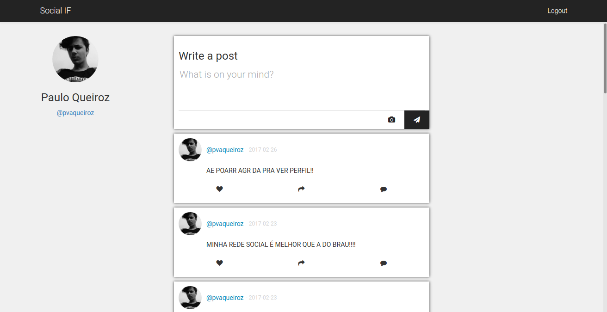

# SOCIAL IF 3

Social network prototype based on Facebook and Twitter aiming to provide better tools for IF students.

## Contribute

You can contribute to the project in almost every possible way, but the best one is to report bugs, feel free to open issues to both report bugs and to make suggestions.
